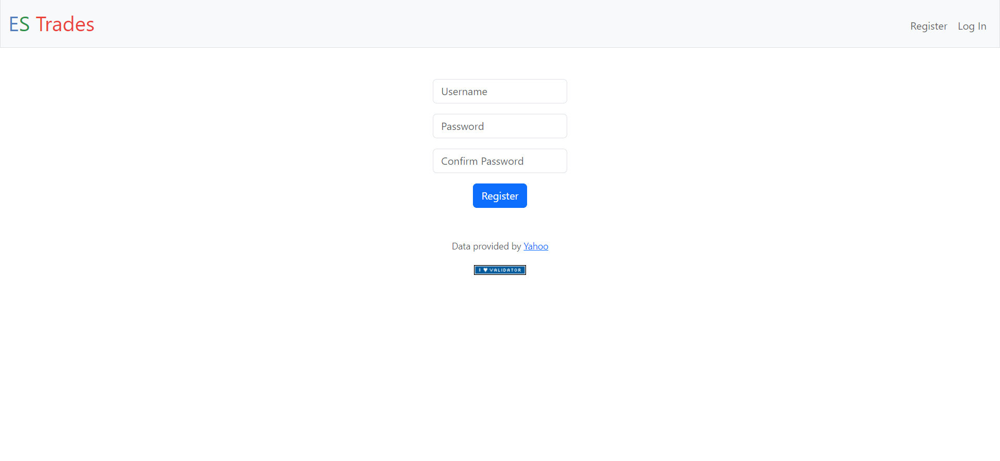

# ES Trades

#### Description:
ES Trades is an extented version of C$50 Finance. ES Trades is a web application where users can manage a portfolio of stocks. This application allows users to track live market prices and to practice trading in a stock market without using real money. This web application uses HTML, CSS, Javascript and jinja for the frontend, Python for the backend, SQLITE for the database and Flask for the framework. The real time stock data is taken from the Finnhub API.

There are 3 tables in the database used in this web application:
1. users -  To store the user's data such as their username, password hash and cash.
2. history - To store the transaction history data such as the user id, stock symbol, number of shares, type of transaction, and time and date of the transaction.
3. holdings - To store data of all the stock holdings of every user such as user's id, stock symbol, number of shares and average cost.

Here are some features of ES Trades!
1. Registration/Login
Users are able to register for an account with a unique username and password and are able to login into said account once registered where each of the user's portolio data are saved. The registration function will check if the username has already been taken, if the confirm password matches the password and the login function will check if the username password is correct.

2. Portfolio
Users are able to view the current market price, the number of shares users are holding, average purchase cost and open profit and loss of each stock in the users portfolio which are imported from the holdings database. The current market price is constantly updated in real time whenever the page is refreshed. The total market value, total open profit and loss and cash holdings are also shown. A Google pie chart of the user's portolio allocation can also be viewed on this page where each stock is organized and data is shown as a percentage of a whole. A buy and sell button is also available for users are also able to purchase or sell the stocks they are holding.

3. Search Stock
Users are able to lookup stocks where they are able to see the current market price and a financial chart of the stock. Users are also able to purchase shares of the stock. The maximum number of shares the user can afford based on their cash holdings is also shown. Finnhub API is used to extract the live market price the stock. A popular stock list is also available to list of most popular stocks filtered by descending total market cap.

4. Buy Shares
When ever the users buy shares of a stock, the function will check if the stock already exist in their portfolio. If it does, the new quantity and the new average price is calculated and updated in the holdings database. If the stock does not already exist, the new stock, quantity and purchased price is added to the database. The users cash holdings are also deducted from the cost of shares purchased in the users database.

5. Sell Shares
Users are able to sell shares of the stock they own. The new quantity is updated whenever a share is sold. If the quantity of a certain stock reaches zero, the stock is removed from the database. The users cash holdings are also updated in the users database based on the value of shares sold.

6. History
Users are able to view their transaction history where the name of stock, number of shares, type of transaction, and time and date of the transaction is shown extracted from the history database.

7. Settings
Users are able to update their current cash holdings and change their password. Whenever the cash holdings and password is updated, the new cash holdings and password will be updated in the users database.
"# ES-Trades" 
