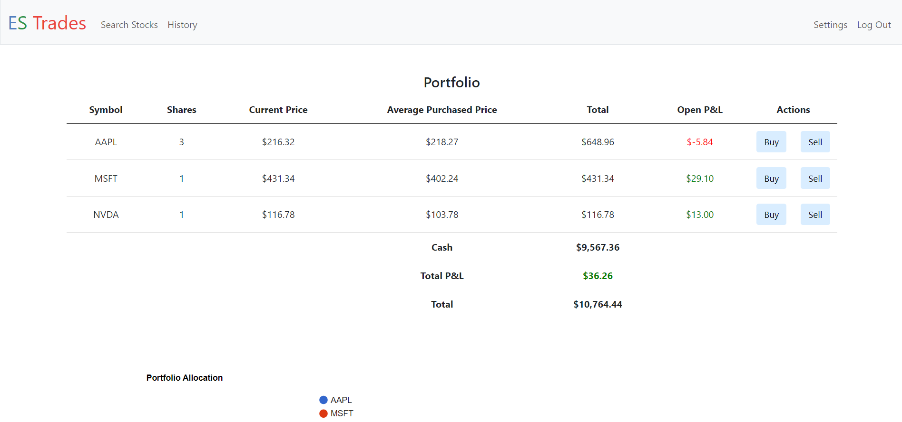
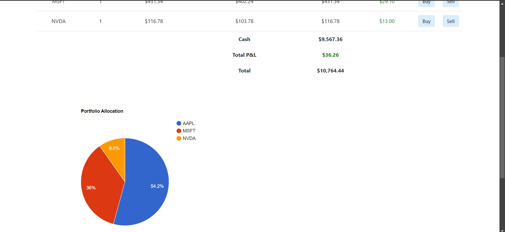
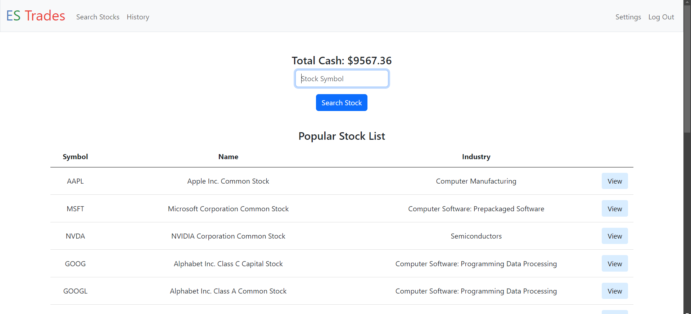
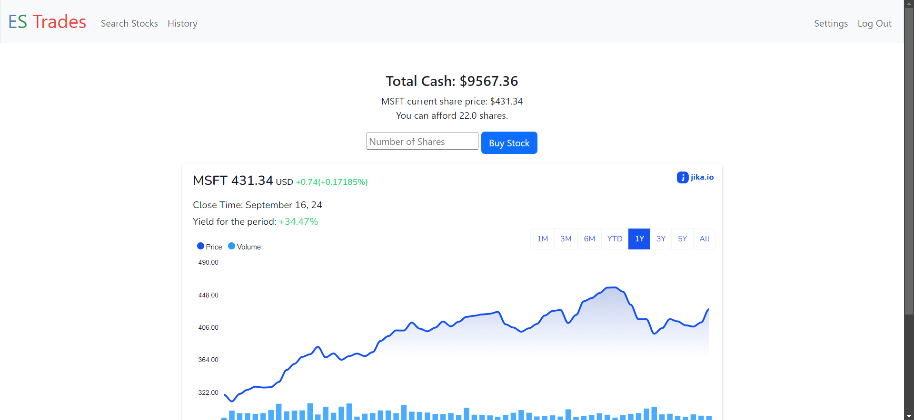
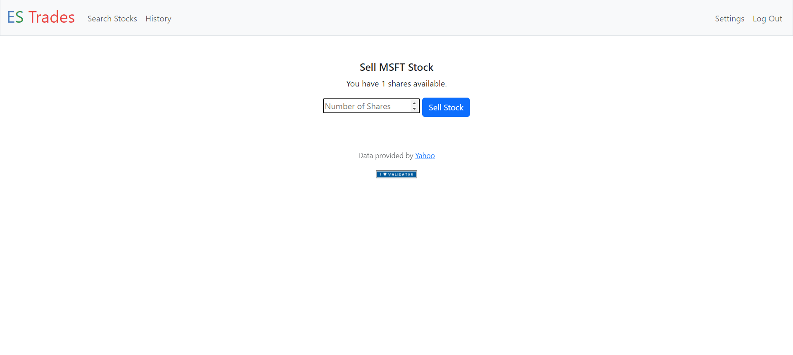
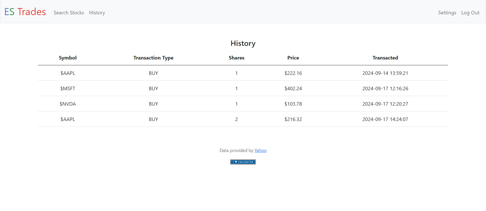
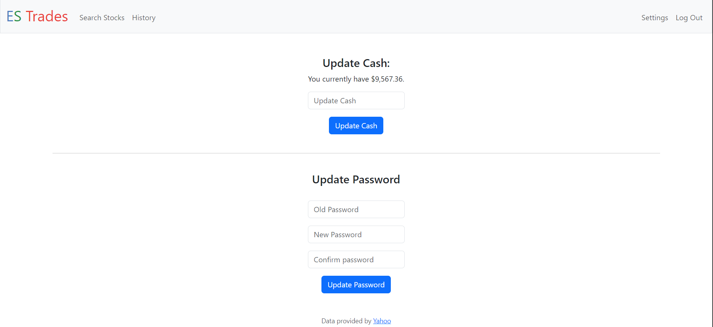

# ES Trades

#### Description:
ES Trades is a web application that allows users to manage a portfolio of stocks. This application allows users to track live market prices and to practice trading in a stock market without using real money. This web application uses HTML, CSS, Javascript and Jinja for the frontend, Python for the backend, SQLite for the database and Flask for the framework. The real-time stock data is taken from the Finnhub API (https://finnhub.io/docs/api/quote). The NASDAQ Stock Screener (https://www.nasdaq.com/market-activity/stocks/screener) was used to generate a list of the most popular stocks. This project was done as the final project for the CS50X course. It was inspired and was expanded upon CS50X Problem Set 9: CS50 Finance (https://cs50.harvard.edu/x/2024/psets/9/finance/).

#### There are 3 tables in the database used in this web application:
1. users — This table stores the user's data such as their username, password hash and cash.
2. history — This table stores the transaction history data such as the user ID, stock symbol, number of shares, type of transaction, and time and date of the transaction.
3. holdings — This table stores data on all the stock holdings of every user such as the user's ID, stock symbol, number of shares and average cost.

Here are some features of ES Trades and how they work!
#### 1. Registration/Login
Users can register for an account with a unique username and password and can log in to said account once registered where each of the user's portfolio data are saved. The registration function will check if the username has already been taken, if the confirm password matches the password and the login function will check if the username password is correct.

#### 2. Portfolio
Users can view the current market price, the number of shares users are holding, the average purchase cost and the open profit and loss of each stock in the user's portfolio which are imported from the holdings database. The current market price is constantly updated whenever the page is refreshed. The total market value, total open profit and loss and cash holdings are also shown. The profit and loss is colour-coded where if the P&L is positive, the value will be shown in green and if the P&L is negative, the value will be shown in red. A Google pie chart of the user's portfolio allocation can also be viewed on this page where each stock is organized and data is shown as a percentage of a whole. A buy and sell button is also available for users are also able to purchase or sell the stocks they are holding.

#### 3. Search Stock
Users can look up stocks where they to see the current market price and a financial chart of the stock. A popular stock list is also available to list of most popular stocks filtered by descending total market cap. When the view button is clicked, the user will be taken to the buy page for the stock.

#### 4. Buy Shares
The maximum number of shares the user can afford based on their cash holdings is also shown. The Finnhub API is used to extract the live market price of the stock. A financial stock chart from jika.io is also shown. Whenever the users buy shares of a stock, the function will check if the stock already exists in their portfolio. If it does, the new quantity and the new average price are calculated and updated in the holdings database. If the stock does not already exist, the new stock, quantity and purchase price are added to the holdings database. Transaction information such as the name of the stock, number of shares, type of transaction, and time and date of the transaction are all added to the history database. The user's cash holdings are also deducted from the cost of shares purchased in the user's database.

#### 5. Sell Shares
Users can sell shares of the stock they own. The quantity of shares owned is shown. The quantity in the holdings database is updated whenever a share is sold. If the quantity of a certain stock reaches zero, the stock is removed from the holding database. Transaction information such as the name of the stock, number of shares, type of transaction, and time and date of the transaction are all added to the history database. The user's cash holdings are also updated in the user's database based on the value of shares sold.

#### 6. History
Users can view their transaction history where the name of stock, number of shares, type of transaction, and time and date of the transaction are extracted from the history database.

#### 7. Settings
Users are able to update their current cash holdings and change their passwords. Whenever the cash holdings and password are updated, the new cash holdings and password will be updated in the user's database.

# How to use:
1) Star and clone the repository to your machine.
2) Go to https://finnhub.io/ and get your free API key. Create a new file in the folder called "creds.py" and type "api_key='[PASTE YOUR API KEY HERE]'" in the file.
3) Run the command "pip install -r requirements.txt"
4) Once all the dependencies have been installed, run the command "python -m flask run"
5) This should start a local server and you can access it on your browser.
